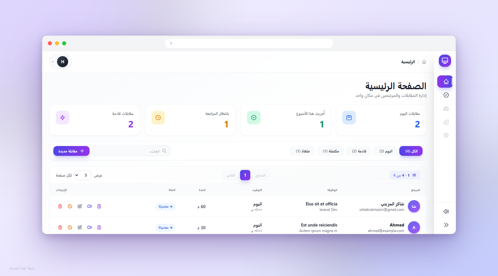
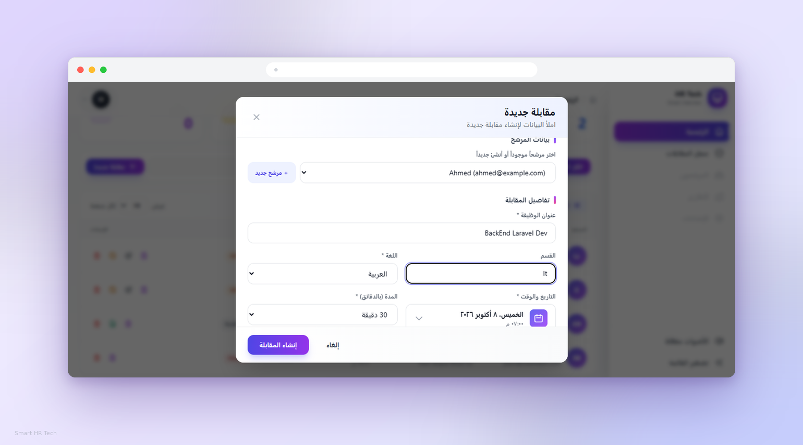
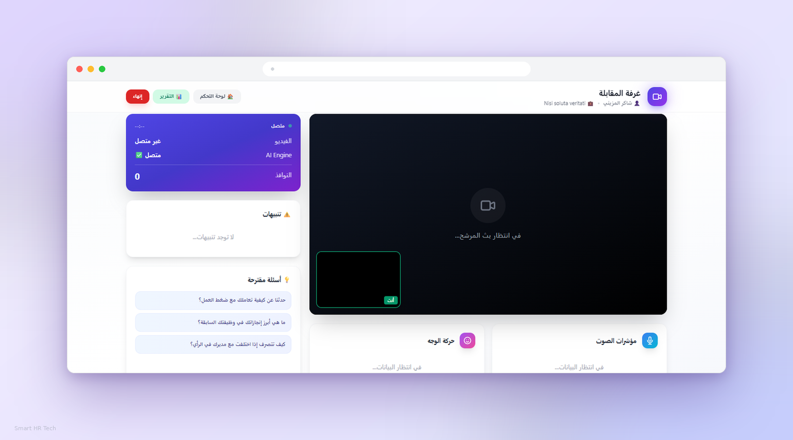
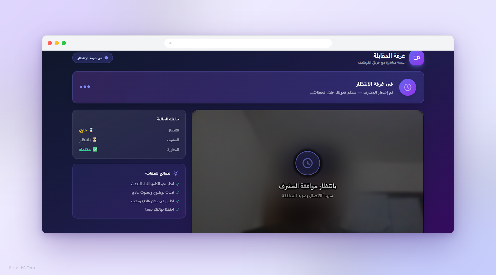
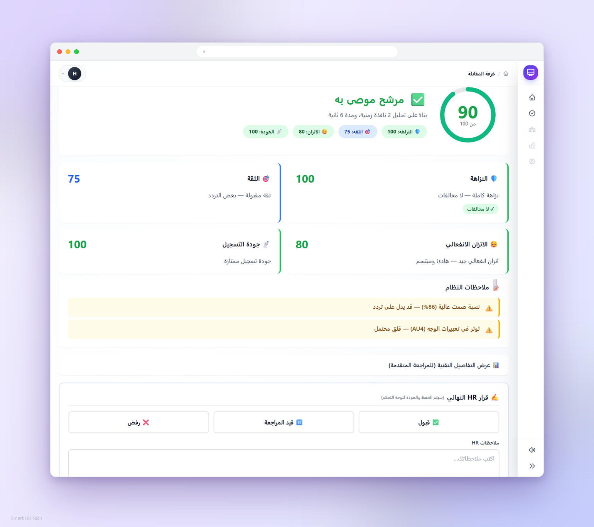
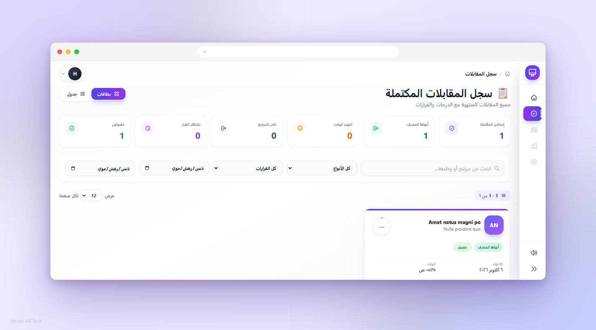

# 🎯 Smart HR Tech System
### نظام المقابلات الذكي

**منصة هجينة متكاملة لأتمتة المقابلات الوظيفية مع تحليل AI حي وتقارير تلقائية**

---

## 📋 جدول المحتويات

- [نظرة عامة](#-نظرة-عامة)
- [الميزات الرئيسية](#-الميزات-الرئيسية)
- [لقطات الشاشة](#-لقطات-الشاشة)
- [الهيكل التقني](#-الهيكل-التقني)
- [البنية المعمارية](#-البنية-المعمارية)
- [التثبيت السريع](#-التثبيت-السريع)
- [دليل الاستخدام](#-دليل-الاستخدام)
- [تكامل n8n](#-تكامل-n8n)
- [بنية المشروع](#-بنية-المشروع)
- [API Endpoints](#-api-endpoints)
- [قاعدة البيانات](#-قاعدة-البيانات)
- [خارطة الطريق](#-خارطة-الطريق)
- [المساهمة](#-المساهمة)
- [الترخيص](#-الترخيص)

---

## 🌟 نظرة عامة

**Smart HR Tech System** هو نظام متكامل لأتمتة المقابلات الوظيفية، يجمع بين:
- 🎥 **مكالمة فيديو ثنائية الاتجاه** (WebRTC P2P)
- 🧠 **تحليل ذكي حي** (Prosody + FACS + YOLO)
- 📊 **تقارير تلقائية** بدرجات موضوعية
- 🤖 **تكامل n8n** لأتمتة المهام الخارجية
- 🌍 **دعم كامل للعربية** (RTL)

النظام مصمم ليكون **بديلاً ذكياً** للمقابلات التقليدية، بتقديم مؤشرات موضوعية عن المرشحين تساعد فريق HR على اتخاذ قرارات مدروسة.

### 🎯 لمن هذا النظام؟

| الفئة | الفائدة |
|---|---|
| **فرق HR** | توفير وقت المراجعة + مؤشرات موضوعية + أرشفة كاملة |
| **الشركات الناشئة** | نظام مقابلات احترافي بدون تكاليف SaaS شهرية |
| **المطورون** | قاعدة كود نظيفة وقابلة للتوسع + تكاملات جاهزة |

---

## ✨ الميزات الرئيسية

<table>
<tr>
<td width="50%" valign="top">

### 🎥 مقابلات فيديو حية
- مكالمة WebRTC ثنائية الاتجاه
- غرفة انتظار + موافقة HR
- Grace Period للمشرف
- دعم اتصال غير محدود

### 🧠 تحليل AI حي
- **Prosody**: نبرة الصوت، الإيقاع، الصمت
- **FACS**: حركات الوجه التفصيلية
- **YOLO**: كشف الهاتف/الأشخاص
- **Quality Gate**: تقييم جودة الإشارة

</td>
<td width="50%" valign="top">

### 📊 تقارير ذكية
- 4 درجات: النزاهة، الثقة، الاتزان، الجودة
- Score Ring متحرك
- ملاحظات تلقائية
- تفاصيل تقنية قابلة للتوسع

### 🤖 تكامل n8n
- 6 أحداث تلقائية
- Queue-based (بدون تأخير)
- قابل للتعطيل/التفعيل
- Retry تلقائي

</td>
</tr>
<tr>
<td width="50%" valign="top">

### 🎨 واجهة احترافية
- Sidebar جانبي موحّد
- Toast notifications موحّدة
- Confirm Modals مخصصة
- أصوات UI (بدون ملفات)

### 📚 سجل المقابلات
- Grid + List views
- فلاتر متقدمة (نوع + قرار + تاريخ)
- 6 بطاقات إحصائية تفاعلية
- Pagination احترافي

</td>
<td width="50%" valign="top">

### 🔐 أمان وموثوقية
- Route Guards للحالات المنتهية
- Backfill تلقائي للبيانات
- Observer Pattern للمزامنة
- Soft Deletes للسجلات

### 🌐 تكاملات جاهزة
- REST API كامل
- Webhooks لـ n8n
- قابل للتوسع بسهولة
- دعم PostgreSQL JSONB

</td>
</tr>
</table>

---

## 📸 لقطات الشاشة

### 🏠 لوحة التحكم الرئيسية
> إحصائيات فورية + فلاتر ذكية + جدول تفاعلي

---

### ➕ إنشاء مقابلة جديدة
> Modal احترافي مع DateTimePicker مخصص

---

### 🎥 غرفة المقابلة (HR)
> مؤشرات AI مباشرة + اقتراحات أسئلة + تنبيهات

---

### 👤 غرفة المرشح
> واجهة عربية أنيقة + نصائح + معايرة تلقائية

---

### 📊 التقرير النهائي
> درجات موضوعية + ملاحظات + قرار HR

---

### 📚 سجل المقابلات المكتملة
> 6 بطاقات إحصائية + Toggle بين Grid/List + فلاتر متقدمة

---

### 🎯 تفاصيل مقابلة مكتملة
> Hero card + Score Ring + KPI + قرار HR

---

## 🛠 الهيكل التقني

### 💻 Stack التطوير

<table>
<tr>
<td align="center" width="20%">
 
<b>Laravel 11</b> 
Backend Framework
</td>
<td align="center" width="20%">
 
<b>Vue 3</b> 
Frontend SPA
</td>
<td align="center" width="20%">
 
<b>FastAPI</b> 
AI Engine
</td>
<td align="center" width="20%">
 
<b>PostgreSQL 16</b> 
Database
</td>
<td align="center" width="20%">
 
<b>Redis</b> 
Cache + Queue
</td>
</tr>
</table>
